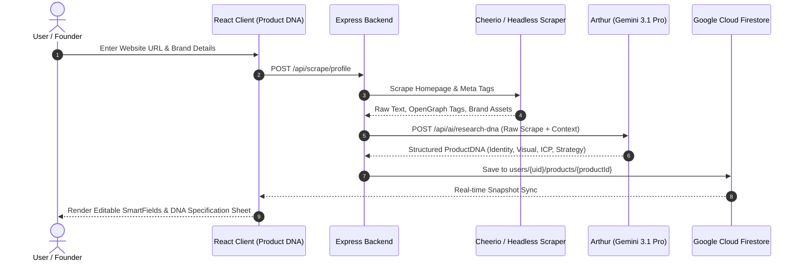
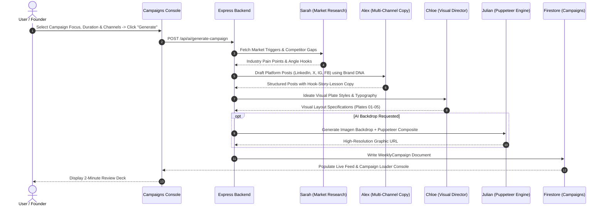
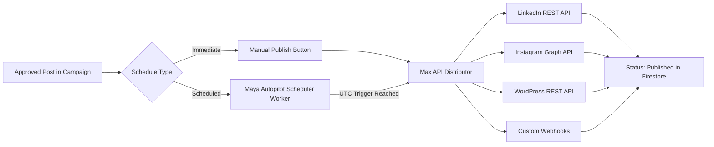

# BrandToPost — Product Overview & System Architecture

> **Autonomous multi-agent marketing engineering platform that transforms founder positioning into research-backed, platform-native social campaigns and visual publishing assets without generic AI slop.**

---

## 1. Executive Summary

### The Problem
Most AI marketing tools function as basic prompt-to-text wrappers ("prompt-vomit" buttons) that optimize exclusively for raw generation speed and volume. This produces generic, ungrounded "AI slop" filled with repetitive corporate jargon, predictable hooks, and synthetic clichés that dilute brand credibility, destroy audience trust, and fail to generate qualified pipeline. For high-growth founders and B2B operators, manually researching market pain points, drafting platform-native copy, designing branded visual assets, and managing daily distribution across LinkedIn, X (Twitter), Facebook, Instagram, Reddit, and WordPress blogs requires either 15–20 hours per week or expensive marketing agencies ($5,000–$10,000/month) that lack deep domain context.

### The Solution
**BrandToPost** replaces fragmented marketing stacks and manual copywriting with a coordinated network of **10 specialized AI agents** managed by a single orchestrator (**TROR**). Instead of generating ad-hoc text from generic prompts, the platform extracts and maintains a persistent, compounding **Brand DNA** profile from the user's live website, founder writings, and customer objection maps. Every week, the agent network conducts live market intelligence, crafts voice-accurate multi-channel posts, composes high-DPI magazine-grade graphic layouts via a headless rendering engine, and prepares a unified **2-Minute Monday Approval Deck**. Founders retain 100% editorial governance with one-click approvals before autonomous scheduling and native API distribution take over.

### Target Audience & Ideal Customer Profile (ICP)
* **B2B SaaS Founders & Tech Executives:** Early-to-growth stage technical founders who need to establish authoritative personal brand presence and capture inbound enterprise demand without spending hours drafting copy.
* **Agency Owners & Growth Consultancies:** Marketing agencies scaling organic reach across multiple client portfolios who require automated research, multi-channel drafting, and centralized approval workflows.
* **Solopreneurs & Creator-Operators:** High-output independent operators needing a full-stack virtual marketing team (researcher, copywriter, creative director, publisher, scheduler) at a fraction of human agency overhead.

### Core Value Proposition & ROI
* **90%+ Reduction in Production Overhead:** Compresses a 20-hour weekly content creation cycle into a 2-minute mobile-friendly review and approval session.
* **Zero Voice Drift:** Arthur (Voice & DNA Clone Agent) maintains strict vocabulary constraints, core mechanisms, and objection handling rules extracted from verified founder materials.
* **Multi-Platform Algorithmic Optimization:** Alex (Multi-Channel Copywriter) tailors formatting, hook velocity, character lengths, and whitespace natively for LinkedIn, X threads, Instagram, Facebook, Reddit, and long-form WordPress SEO blogs.
* **Deterministic Visual Publication:** Julian & Chloe headless graphics pipeline renders pixel-perfect, typography-calibrated branded cards with strict collision prevention and custom logo stamps.

---

## 2. What the Product Actually Does (Feature Breakdown)

### 2.1. Brand DNA Ingestion & Voice Cloning
* **What it does:** Scrapes, extracts, and structures the entire strategic and visual identity of a brand into an editable, persistent knowledge base called **Brand DNA**.
* **How it works under the hood:** 
  * Backend endpoints (`/api/scrape/profile`, `/api/ai/research-dna`) utilize Cheerio and headless scraping to extract website metadata, core value propositions, target audiences, and color palettes.
  * Gemini 3.1 Pro synthesizes four structured vectors: **Identity** (mission, tagline, core pillars), **Visual DNA** (primary/secondary hex palettes, typography pairings, logo assets), **Psychographics** (ICP profiles, core objections, objection handling, tone rules), and **Strategy** (content pillars, key metrics, positioning angles).
  * Synthesized DNA is stored in Firestore (`users/{uid}/products/{productId}`) and dynamically injected into downstream agent system prompts.
* **User-facing capability:** Users paste a URL or input company details in the **Product DNA Studio**, review extracted smart fields with inline auto-resizing textareas, modify tone constraints, upload brand logos, and export a formatted Brand DNA PDF briefing report.
* **Status:** **Shipped & Fully Functional**.

---

### 2.2. Multi-Agent Autonomous Campaign Generation
* **What it does:** Produces full 7-day to 30-day multi-channel organic campaigns rooted in current market triggers, competitor gaps, and brand positioning.
* **How it works under the hood:** 
  * Orchestrated via `/api/ai/generate-campaign` and `/api/ai/research-focus`.
  * **Sarah** queries real-time market trends and audience friction points.
  * **Alex** generates platform-native copy for selected social platforms (LinkedIn hook-story-lesson frameworks, X multi-tweet threads, Facebook value posts, Instagram carousel captions, Reddit discussion starters).
  * **Chloe** specifies visual layout concepts, text overlays, color contrasts, and typography placements.
  * **Zack** writes video scripts with B-roll visual cues and hook timings.
  * Payloads are validated against strict JSON schemas before being written to the user's `campaigns` subcollection in Firestore.
* **User-facing capability:** A streamlined campaign creation modal allows users to select campaign focus (e.g., Thought Leadership, Feature Launch, Objection Handling, Case Study), choose active platforms, trigger generation, and watch live diagnostic progress in the `CampaignLoaderConsole`.
* **Status:** **Shipped & Fully Functional**.

---

### 2.3. Studio Visual Engine & Creative Editing
* **What it does:** Automatically generates and lets users customize high-resolution social cards, quote plates, and backdrop images matching the brand's exact visual guidelines.
* **How it works under the hood:** 
  * Combines client-side DOM rendering (`VisualEngine.tsx`) with server-side Puppeteer graphic generation (`/api/render-visual-card`, `/api/render-canvas`).
  * Dynamic layout engine enforces strict collision boundaries between headings, sub-copy, author badges, and brand logos (`B2PLOGO.png` / custom brand marks).
  * AI backdrop generation routes to `gemini-3.1-flash-image-preview` (Imagen) via `/api/ai/generate-backdrop` to synthesize textures and editorial visuals.
  * Mutex lock safeguard (`runWithRenderLock` in `server.ts`) prevents memory spikes during concurrent headless browser exports.
* **User-facing capability:** Users click on any campaign post card to open the **Visual Editor Modal** / Lightbox, adjust typography sizing, switch layout templates (Plate No. 01–05, Editorial Split, Minimal Card, Dark Room), modify background opacities, and download high-DPI PNGs.
* **Status:** **Shipped & Fully Functional**.

---

### 2.4. Editorial 2-Minute Review & Campaign Management
* **What it does:** Provides a centralized dashboard and interactive calendar to preview, edit, batch-approve, and organize weekly marketing deliverables.
* **How it works under the hood:** 
  * Real-time Firestore snapshot listeners (`onSnapshot`) synchronize campaign state across devices.
  * Optimistic UI updates handle inline copy edits, post deletion, platform re-targeting, and date rescheduling.
  * Batch action engine allows selecting multiple campaigns for bulk approval or deletion.
* **User-facing capability:** Interactive workspace featuring platform filtering tabs (LinkedIn, X, Facebook, Instagram, Reddit, TikTok, YouTube), copy-to-clipboard formatting buttons, one-click "Approve All" banner, and calendar view.
* **Status:** **Shipped & Fully Functional**.

---

### 2.5. Multi-Channel Native Publishing & Webhooks
* **What it does:** Directly publishes approved campaigns to connected third-party networks on scheduled dates or on-demand.
* **How it works under the hood:** 
  * Dedicated backend service proxies handle OAuth tokens and API dispatches:
    * `/api/linkedin/post`: LinkedIn REST API integration for text and media uploads.
    * `/api/instagram/post`: Meta Graph API container creation and media publishing.
    * `/api/blog/publish`: WordPress REST API & custom webhook dispatcher for long-form articles with auto-generated cover images.
  * Autopilot worker (`Maya` & `Max`) continuously polls scheduled posts in Firestore, checks UTC timestamps, executes dispatches, and logs delivery status.
* **User-facing capability:** Account connection toggles in Settings/Campaigns, one-click "Publish Now" actions, and automatic scheduled status badges (Draft -> Queued -> Published).
* **Status:** **Shipped (LinkedIn, Instagram, WordPress, Webhooks)** / Twitter API in config.

---

### 2.6. Under Construction Experimental Suite
* **WhatsApp Autonomous Bot (Module 01):** Voice-note interaction layer to review Monday campaign decks and trigger 1-tap quick approvals via WhatsApp Messenger (Twilio/Meta WhatsApp Business API). *(Status: API Webhooks Calibrating / Q3 Target)*.
* **Script Studio & B2B Screenwriter (Module 02):** Dedicated video scriptwriting console led by Zack, providing scene-by-scene timing, Luma/Sora B-roll prompts, and audio direction. *(Status: Screenplay Engine Locked / In Calibration)*.
* **Visual Graphic Canvas Editor (Module 03):** Freeform browser-based design canvas for complex multi-layer composition, custom vector overlays, and typography plates. *(Status: Canvas v3 Renderer Under Construction)*.

---

## 3. The Specialist Agent Roster

The BrandToPost ecosystem operates through **10 autonomous specialist agents** coordinated by **TROR (The Conductor)**. Each specialist has dedicated prompt engineering layers, strict output schemas, and specific operational domains.

```
                               ┌───────────────────────────┐
                               │   TROR (The Conductor)    │
                               │ Master Engine Orchestrator│
                               └─────────────┬─────────────┘
                                             │
      ┌──────────────┬──────────────┬────────┴─────┬──────────────┬──────────────┐
      │              │              │              │              │              │
┌─────┴──────┐ ┌─────┴──────┐ ┌─────┴──────┐ ┌─────┴──────┐ ┌─────┴──────┐ ┌─────┴──────┐
│   Arthur   │ │   Sarah    │ │    Alex    │ │   Chloe    │ │   Julian   │ │    Zack    │
│ Voice Clone│ │ Market Res.│ │ Copywriter │ │  Creative  │ │ Visual Pub.│ │Video Script│
└─────┬──────┘ └────────────┘ └────────────┘ └────────────┘ └────────────┘ └────────────┘
      │
      ├──────────────┬──────────────┬──────────────┐
      │              │              │              │
┌─────┴──────┐ ┌─────┴──────┐ ┌─────┴──────┐ ┌─────┴──────┐
│    Maya    │ │   Victor   │ │    Max     │ │   Elena    │
│ Scheduler  │ │ Mobile CRM │ │ API Distrib│ │ Analytics  │
└────────────┘ └────────────┘ └────────────┘ └────────────┘
```

| Agent Name | Title / Specialty | System Role & Purpose | Model Tier Allocation | Core Responsibilities & Artifacts |
| :--- | :--- | :--- | :--- | :--- |
| **TROR** | Master Conductor | System Orchestrator & Workflow Router | Code Logic / `gemini-3.1-pro-preview` | Coordinates cross-agent data handoffs, manages multi-step execution pipelines, and ensures strict quality gating. |
| **Arthur** | Voice & DNA Clone | Founder Persona Calibration | `gemini-3.1-pro-preview` | Ingests website content and founder writings to calibrate vocabulary constraints, heuristics, tone rules, and objection handling. Produces `ProductDNA` profiles. |
| **Sarah** | Market Researcher | Live Market & Trigger Intelligence | `gemini-3.5-flash` / Google Search | Conducts competitive landscape scans, extracts industry complaints, discovers trending market triggers, and maps audience friction points. |
| **Alex** | Multi-Channel Copywriter | Platform-Native Copy Engineering | `gemini-3.5-flash` | Formulates high-conversion copy tailored for LinkedIn algorithms, X threads, Instagram carousels, Facebook value posts, and Reddit discussions. |
| **Chloe** | Creative Director | Visual Aesthetic & Card Layout Ideation | `gemini-3.5-flash` | Generates visual concepts, typographic hierarchy rules, color contrast palettes, and negative space formatting directives for social cards. |
| **Julian** | Visual Publisher | Headless Graphics Rendering Engine | Puppeteer + `gemini-3.1-flash-image-preview` | Renders high-DPI editorial cards, calculates non-colliding logo stamps, synthesizes backdrop textures, and exports PNG graphic templates. |
| **Zack** | Video Screenwriter | B2B Screenplay & Video Scripting | `gemini-3.5-flash` | Formulates structured video screenplays, scene-by-scene pacing, teleprompter scripts, and text-to-video (Luma/Sora/Runway) generative prompts. |
| **Maya** | Autopilot Scheduler | Queue & Calendar Management | Node.js Scheduler / `gemini-2.5-flash` | Manages campaign queues, resolves posting time slots across timezones, and orchestrates the weekly 2-minute review deck. |
| **Victor** | Mobile CRM / WhatsApp | Mobile Interaction Protocol | Webhook Engine / `gemini-2.5-flash` | Connects conversational interfaces (WhatsApp Bot) to deliver campaign review decks directly to founder mobile devices for rapid reply-approvals. |
| **Max** | API Distributor | Direct Social Platform Pipeline | Express Server / REST APIs | Authenticates OAuth credentials and directly dispatches approved media and copy to LinkedIn, Meta/Instagram, and WordPress endpoints. |
| **Elena** | Campaign Reporter | Analytics & Performance Insights | `gemini-3.5-flash` | Analyzes campaign cadence, content pillar distributions, platform coverage, and audience resonance to guide future content iterations. |

---

## 4. User Journey & End-to-End Workflows

### 4.1. Onboarding & Brand DNA Extraction (Minutes 0–3)


### 4.2. Campaign Generation & Creative Asset Pipeline (Minutes 3–8)


### 4.3. 2-Minute Review & Creative Customization
1. **Review:** The founder navigates to the **Campaigns** console. The top banner highlights the weekly queue with one-click **"Approve All"** or individual post inspection.
2. **Visual Customization:** Clicking any post card opens the **Visual Editor Modal** or **Image Lightbox**. The founder can swap graphic plates, tweak heading typography, toggle dark/light backgrounds, or regenerate backdrops with new AI prompts.
3. **Copy Refinement:** Text can be edited inline with instant auto-saving to Firestore. Formatted copy buttons allow immediate copying with preserved platform line breaks and unicode formatting.

### 4.4. Autonomous Scheduling & Multi-Channel Distribution


---

## 5. Technical Architecture & System Specifications

### 5.1. System Topology
```
┌────────────────────────────────────────────────────────────────────────┐
│                       CLIENT TIER (React 18 SPA)                       │
│  Vite 5.2 • Tailwind CSS v4 • Lucide React • React Icons • GSAP • HTML5│
│  Contexts: AuthContext (Firebase Auth) • ProductContext (State Store)  │
└───────────────────────────────────┬────────────────────────────────────┘
                                    │ HTTPS / REST (JSON Payloads)
                                    ▼
┌────────────────────────────────────────────────────────────────────────┐
│                     SERVER TIER (Node.js & Express)                    │
│  Express 4.19 • TypeScript (tsx) • Express Rate Limit • Helmet/CORS   │
│  Middlewares: Firebase Token Verifier • Error Integrity Handler       │
├────────────────────────────────────────────────────────────────────────┤
│  Routing Architecture:                                                 │
│  • /api/ai/*         -> Gemini 3.1 Pro / 3.5 Flash Proxy Handlers     │
│  • /api/scrape/*     -> Cheerio / Headless Web Ingestion               │
│  • /api/render-*     -> Headless Puppeteer Graphic Generator           │
│  • /api/linkedin/*   -> LinkedIn OAuth & Media Share Dispatcher        │
│  • /api/instagram/*  -> Meta Graph API Container & Publish Proxy       │
│  • /api/blog/*       -> WordPress REST API & Webhook Dispatcher        │
└──────────────────┬───────────────────────────────┬─────────────────────┘
                   │                               │
                   ▼                               ▼
┌──────────────────────────────────────┐ ┌───────────────────────────────┐
│        AI & RENDERING INFRA          │ │      DATA PERSISTENCE         │
│ • Google Gen AI SDK (@google/genai)  │ │ • Google Cloud Firestore      │
│   - gemini-3.1-pro-preview           │ │   (Database: productiondb)    │
│   - gemini-3.5-flash                 │ │ • Firebase Storage Assets     │
│   - gemini-3.1-flash-image-preview   │ │ • Firebase Client Auth        │
│ • Puppeteer Headless Chrome v25      │ │ • Firestore Security Rules    │
│ • Mutex Lock (runWithRenderLock)     │ │   (Owner-scoped read/write)   │
└──────────────────────────────────────┘ └───────────────────────────────┘
```

### 5.2. Technology Stack Manifest

| Layer | Technology | Version | Purpose / Architectural Responsibility |
| :--- | :--- | :--- | :--- |
| **Frontend Framework** | React | `^18.3.1` | Core declarative component UI library. |
| **Build Tool** | Vite | `^5.2.0` | Ultra-fast HMR and optimized production bundling. |
| **Styling** | Tailwind CSS | `^4.0.0` | Modern utility styling integrated with custom design tokens. |
| **Icons & Media** | Lucide React / React Icons | `^1.16.0` / `^5.4.0` | High-fidelity iconography (platform logos, UI glyphs). |
| **Animation Engine** | GSAP / Motion | `^3.14.0` / `^12.38.0` | Smooth scroll triggers, solitaire deck shuffles, modal transitions. |
| **Backend Server** | Express | `^4.19.2` | REST API layer, authentication proxies, rate limiting. |
| **Server Runtime** | Node.js + `tsx` | `^4.7.1` | Native TypeScript server execution without separate build step. |
| **AI Gateway** | `@google/genai` | `^0.1.2` | Google GenAI SDK communicating with Gemini model endpoints. |
| **Database** | Google Cloud Firestore | `@google-cloud/firestore ^7.11` | Real-time multi-tenant document database (`productiondb`). |
| **Client Auth** | Firebase SDK | `^12.1.0` | Google & Email/Password JWT client authentication. |
| **Headless Browser** | Puppeteer | `^25.0.0` | Server-side screenshotting and dynamic HTML-to-PNG rendering. |
| **Web Ingestion** | Cheerio | `^1.0.0-rc.12` | Server-side HTML parsing for instant brand extraction. |
| **PDF Generation** | jsPDF + html2canvas | `^2.5.2` / `^1.4.1` | Client-side export of comprehensive Brand DNA briefing PDFs. |

---

### 5.3. AI Model Task Matrix & Safety Governance

The application enforces a strict task-to-model allocation matrix configured in `src/services/geminiService.ts` and `server.ts`:

```
┌─────────────────────────────────────────────────────────────────────────┐
│                       GEMINI MODEL ALLOCATION MATRIX                    │
├──────────────────────────┬───────────────────────┬──────────────────────┤
│ Task Category            │ Assigned Gemini Model │ Temperature & Schema │
├──────────────────────────┼───────────────────────┼──────────────────────┤
│ Brand DNA Synthesis      │ gemini-3.1-pro-preview│ 0.2 (Deterministic)  │
│ Multi-Channel Campaigns  │ gemini-3.5-flash      │ 0.7 (Structured JSON)│
│ Focus & Market Research  │ gemini-3.5-flash      │ 0.4 (Fact-Grounded)  │
│ Visual Concept Ideation  │ gemini-3.5-flash      │ 0.6 (Creative Layout)│
│ Post Formatting & Tweaks │ gemini-2.5-flash      │ 0.3 (Fast Transform) │
│ Generative Card Backdrops│ gemini-3.1-flash-image│ 1.0 (Imagen Seeded)  │
└──────────────────────────┴───────────────────────┴──────────────────────┘
```

* **JSON Schema Enforcement:** Outbound generation prompts utilize strict response schemas (`responseMimeType: "application/json"`) with fallback parsing algorithms to guarantee valid campaign objects.
* **Rate Limiting & Isolation:** All Gemini API keys are isolated on the Express backend. Client requests pass through `routeRateLimiter` to prevent quota exhaustion and API abuse.
* **Mutex Safeguards:** Heavy graphic generation tasks are queued inside `runWithRenderLock` in `server.ts` to prevent Out-Of-Memory (OOM) crashes under concurrent user loads.

---

### 5.4. Firestore Data Governance & Collection Schema

All database operations persist to the Google Cloud Firestore instance (`productiondb`) under owner-isolated security boundaries (`firestore.rules`):

```
productiondb (Root Firestore Database)
├── users/{uid}                                    # User profile & global settings
│   ├── email: string
│   ├── createdAt: timestamp
│   ├── settings: { timezone, notifications, ... }
│   │
│   ├── products/{productId}                       # Brand DNA Document Store
│   │   ├── id: string (UUID)
│   │   ├── name: string                           # Brand / Company Name
│   │   ├── url: string                            # Source Website URL
│   │   ├── identity: { mission, tagline, pillars: [] }
│   │   ├── visual: { primaryColor, secondaryColor, fonts: [], logoUrl }
│   │   ├── psychographics: { icp, objections: [], toneRules: [] }
│   │   ├── strategy: { contentPillars: [], differentiators: [] }
│   │   └── founderAgent: { voiceRules: [], stories: [], coreBeliefs: [] }
│   │
│   └── campaigns/{campaignId}                     # Weekly Campaign Store
│       ├── id: string (UUID)
│       ├── productId: string (Foreign Key -> products.id)
│       ├── weekStartDate: string (YYYY-MM-DD)
│       ├── focus: string                          # Strategic Campaign Theme
│       ├── status: "draft" | "approved" | "published"
│       └── days: [                                # 7-Day Campaign Array
│           ├── dayNumber: number (1..7)
│           ├── theme: string
│           ├── platforms: [
│           │   ├── platform: "linkedin"|"x"|"instagram"|"facebook"|"reddit"
│           │   ├── content: string                # Formatted Post Body
│           │   ├── hook: string                   # Scroll-stopping Hook
│           │   ├── visualData: {
│           │   │   ├── templateId: "plate-01".."plate-05"
│           │   │   ├── headingText: string
│           │   │   ├── subText: string
│           │   │   ├── baseImage: string (Base64 / URL)
│           │   │   └── accentColor: string
│           │   │   }
│           │   └── status: "draft" | "approved" | "published"
│           │   ]
│           └── videoScript: { hook, scenes: [], callToAction }
```

---

## 6. Design System & The Anti-Slop Codex

BrandToPost is built on a custom design system formulated in `design.md` and implemented across `src/index.css`. It strictly rejects standard, generic SaaS aesthetic tropes in favor of an **editorial, tech-luxury visual language**.

```
┌─────────────────────────────────────────────────────────────────────────┐
│                          THE ANTI-SLOP CODEX                            │
├───────────────────────────────────┬─────────────────────────────────────┤
│ ❌ REJECTED SAAS CLICHÉS          │ ✅ BRANDTOPOST EDITORIAL STANDARD   │
├───────────────────────────────────┼─────────────────────────────────────┤
│ Floating pill badges ("✨ AI")     │ Clean typographic labels (Inter)    │
│ Blue-to-purple gradient meshes    │ Pitch Black (#08080C) & Cream White │
│ Floating card soup with shadows   │ Flat editorial canvas & hairline rules│
│ UPPERCASE MONOSPACE BUTTONS       │ Sentence-case balanced typography   │
│ Generic gray backgrounds (#F3F4F6)│ Warm architectural off-white (#FAF9F6)│
│ Cluttered multi-level navigation  │ Consolidated, tabbed workspaces     │
└───────────────────────────────────┴─────────────────────────────────────┘
```

### 6.1. Color System Tokens

```
┌────────────────────────────────────────────────────────────────────────┐
│                        CORE BRAND COLOR PALETTE                        │
├────────────────┬───────────┬───────────────────────────────────────────┤
│ Token Name     │ Hex Value │ Semantic Role                             │
├────────────────┼───────────┼───────────────────────────────────────────┤
│ Canvas Warm    │ #FAF9F6   │ Primary light background (Editorial Warm) │
│ Canvas Dark    │ #08080C   │ Tech-luxury header & dark stage canvas    │
│ Pitch Black    │ #000000   │ High-contrast typography & mascots        │
│ Brand Purple   │ #7C3AED   │ Primary accent, active states, Arthur     │
│ Signal Blue    │ #2583EB   │ Outreach routing, X threads, Sarah        │
│ Coral Accent   │ #FF7778   │ Positioning DNA, objection badges, Zack   │
│ Signal Green   │ #10B981   │ Traction autopilot, approval confirmation │
│ Hairline Rule  │ #0F172A/10│ Subtle structural separation (1px borders)│
└────────────────┴───────────┴───────────────────────────────────────────┘
```

### 6.2. Typography System
* **Primary Sans (`--font-sans`):** `Inter Tight`, `Inter`, `-apple-system`, `sans-serif`. Engineered for high legibility in dense data grids and platform post mockups.
* **Display / Editorial Headings (`--font-display`):** `Playfair Display`, `Newsreader`, `serif`. Used for high-impact editorial statements, section titles, and magazine plate graphics.
* **Code & Technical Metadata (`--font-mono`):** `JetBrains Mono`, `ui-monospace`, `monospace`. Employed for plate indices (`PLATE NO. 04`), timestamp logs, status flags, and API indicators.

### 6.3. Signature UI Components
* **Solitaire Interactive Deck (`AgentSolitaireCards.tsx`):** A custom, wheel-captured card deck component that presents the 10 specialist agents as full-bleed playing cards with corner suit ranks (A, K, Q, J, 10...) and shuffle transitions.
* **SmartField Auto-Resizing Inputs:** Inline editable fields with pencil toggle triggers and dynamic scroll-height expansion that eliminate awkward modal forms.
* **Flowing Wave Vector Canvas:** Hand-crafted SVG wave vector lines used as organic visual dividers between dark and light thematic sections.
* **Firecracker SVG Wordmark:** An animated, traced vector logo banner in the footer with continuous gradient glow dashes.

---

## 7. Pricing & Commercial Matrix

The platform offers three transparent subscription configurations grounded directly in specialist agent allocations:

```
┌─────────────────────────────────────────────────────────────────────────┐
│                          SUBSCRIPTION TIERS                             │
├─────────────────────┬───────────────────┬───────────────────────────────┤
│ Plan Tier           │ Pricing           │ Active Specialist Roster      │
├─────────────────────┼───────────────────┼───────────────────────────────┤
│ 01. Solo Founder    │ ₹2,499 / month    │ Sarah (Research), Alex (Copy),│
│                     │                   │ Chloe (Visuals), Julian (Gfx),│
│                     │                   │ Elena (Publisher)             │
├─────────────────────┼───────────────────┼───────────────────────────────┤
│ 02. Growth Autopilot│ ₹4,499 / month    │ All Tier 1 + Arthur (Voice),  │
│    (Recommended)    │                   │ Maya (Scheduler), Zack (Video)│
├─────────────────────┼───────────────────┼───────────────────────────────┤
│ 03. Agency Partner  │ ₹12,499 / month   │ All 10 Specialists including  │
│                     │                   │ Victor (WhatsApp CRM) & Max   │
│                     │                   │ (Autopilot Monitor)           │
└─────────────────────┴───────────────────┴───────────────────────────────┘
```

### Plan Details & Entitlements
* **Tier 01 — Solo Founder (₹2,499/mo):**
  * Targeted at early founders getting consistent social presence off the ground.
  * 5 active specialist agents.
  * Standard multi-channel generation (LinkedIn, X, Facebook).
  * High-DPI graphic card export.
* **Tier 02 — Growth Autopilot (₹4,499/mo) [Flagship]:**
  * Targeted at growth-stage founders wanting full voice-cloned authority.
  * 8 active specialist agents including **Arthur** (Personal Voice Clone) and **Zack** (Video Screenwriting).
  * Compounding Brand DNA memory and objection handling engine.
  * Automated weekly campaign queue and calendar scheduling.
* **Tier 03 — Agency Partner (₹12,499/mo):**
  * Targeted at multi-brand agencies and high-output founder networks.
  * Complete **10-specialist network** unlocked.
  * Mobile WhatsApp integration for direct 1-tap review and approval workflows.
  * Multi-brand product workspace management and custom webhook distribution.

---

## 8. Implementation Status & Product Roadmap

```
┌────────────────────────────────────────────────────────────────────────┐
│                      FEATURE IMPLEMENTATION AUDIT                      │
├────────────────────────────────────────────────────────┬───────────────┤
│ Module / Capability                                    │ Status        │
├────────────────────────────────────────────────────────┼───────────────┤
│ Automated Website Ingestion & Brand DNA Synthesis      │ ✅ Shipped    │
│ Multi-Channel Campaign Generation (LinkedIn, X, IG, FB)│ ✅ Shipped    │
│ Headless Puppeteer Graphic Card Rendering Engine       │ ✅ Shipped    │
│ AI Backdrop Generation (Imagen / Gemini Flash Image)   │ ✅ Shipped    │
│ 2-Minute Review Deck & Inline SmartField Editing       │ ✅ Shipped    │
│ Multi-Product DNA Switching Workspace                  │ ✅ Shipped    │
│ Interactive Solitaire 10-Agent Visual Roster           │ ✅ Shipped    │
│ LinkedIn Direct Publishing API Proxy                   │ ✅ Shipped    │
│ Instagram Container Publishing API Proxy               │ ✅ Shipped    │
│ WordPress REST API & Webhook Article Dispatcher        │ ✅ Shipped    │
│ PDF Brand DNA Briefing Report Generator                │ ✅ Shipped    │
│ Module 01 — WhatsApp Autonomous Bot (Twilio/Meta)      │ 🚧 In Calib.  │
│ Module 02 — Script Studio & B2B Screenwriter (Zack)    │ 🚧 In Calib.  │
│ Module 03 — Freeform Visual Graphic Canvas Editor      │ 🚧 In Calib.  │
│ Direct Twitter / X OAuth 2.0 Native Publishing         │ ⏳ Scheduled  │
│ Multi-Account Agency Team Role Governance              │ ⏳ Scheduled  │
└────────────────────────────────────────────────────────┴───────────────┘
```

---

## 9. Security, Governance & Verification

* **Authentication Boundaries:** All application routes require valid Firebase JWT tokens passed in the `Authorization: Bearer <token>` header. The Express server verifies credentials via the Firebase Admin SDK prior to executing data queries or AI generation loops.
* **Multi-Tenant Data Isolation:** Firestore security rules enforce strict document ownership (`request.auth.uid == resource.data.uid`), preventing cross-tenant data leakage.
* **Memory & Resource Safety:** Concurrent headless browser instances are constrained via `runWithRenderLock` mutex locks with explicit timeouts to ensure backend stability in production environments.
* **Codebase Health:** Clean TypeScript type coverage adhering to `src/types.ts` without generic untyped payloads.
